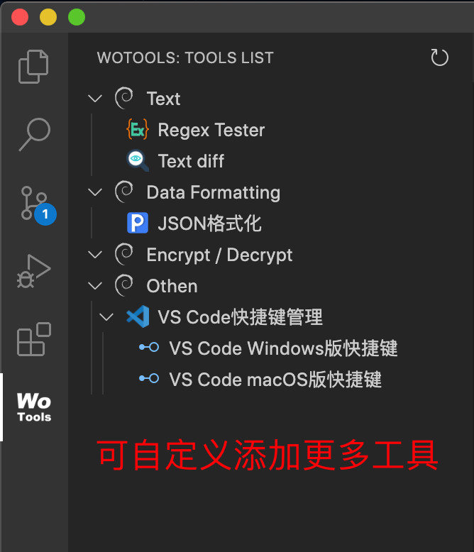

[中文说明](README.zh-CN.md)

# woTools VSCode plugin

woTools is a web tools platform, it categorizes and centrally manages your web tools.

Search for `woTools` in the VSCode extension and install the plugin.



# Description

It can easily manage your multiple web tools.

You can put your commonly used Web tools into the VSCode plugin, and the VSCode plugin will display your list of Web tools in a tree form.

# A web tool

A web tool, it's also a web page, it's an offline HTML file that can be used locally.

For example an html page for formatting JSON.

# Quick start

1. Create a Web tool folder, e.g. `html-format`, Create a `index.html` and `plugin.json` file in the folder.

2. Feel free to type in some test content in the `index.html`. (External files referenced in the HTML file, such as.png/.css/.js, can only use relative paths.)

3. The content of `plugin.json` is specified below.

4. Find the installation directory of the VSCode plugin, then go to the `vscode-wotools/plugins` directory, copy the `html-format` folder you just created into the `plugins` directory.

5. Clicking the refresh button in the top right corner of the woTools plugin will reload the list of Web tools and the newly added `html-format` will be displayed in the list.

## About plugin.json file

```javascript
{
    "main": "index.html", // entry file name (required)
    "logo": "logo.png", // icon
    "id": "html-format", // plugin unique ID (required)
    "displayName": "HTML Format", // plugin name (required)
    "description": "description...", // plugin description
    "version": "0.0.1", // plugin version
    "author": "unknown", // plugin author
    "homepage": "http://unknown", // home page
    "categoryId": "normal-tool", // category id
    "disable": false // after disabled, the plugin list is not displayed
    // after using children, the above main entry file will become invalid
    "children": [
        {
            "main": "index.html", // child entry file
            "displayName": "HTML4 Format"
        },
        {
            "main": "index2.html", // child entry file
            "displayName": "HTML5 Format"
        }
    ]
}
```

# Development

## Global variable or function

All global variables or functions are placed under the `wotools` variable and can be printed and viewed using`console.log(wotools)`.

1. `wotools.language`

    Gets the current language of VSCode, used in javascript, which returns `en` or `zh-cn`.

2. `wotools.gotoPage('relative path and file name')`

    Page redirection.

    In VSCode plugin，redirecting with `<a href="index2.html">goto</a>` is forbidden in HTML files.
    If multiple pages need to be redirected to each other, the following is an example:

```javascript
// html
<a onClick="goto()">redirect to index2.html</a>;

// javascript
function goto() {
    wotools.gotoPage('index2.html');
}
```

## Category management

You can modify the Category data by yourself.

In the woTools VSCode plugin installation directory, modify the `data/category.json` file.

The initial content.

```javascript
[
    {
        id: 'text',
        displayName: {
            en: 'Text',
            'zh-cn': '文本',
        },
        order: 1,
    },
    {
        id: 'data-format',
        displayName: {
            en: 'Data Formatting',
            'zh-cn': '数据格式化',
        },
        order: 2,
    },
    {
        id: 'encrypt-decrypt',
        displayName: {
            en: 'Encrypt / Decrypt',
            'zh-cn': '加密 / 解密',
        },
        order: 3,
    },
    {
        id: 'other',
        displayName: {
            en: 'Othen',
            'zh-cn': '其它',
        },
        order: 4,
    },
];
```

## Sample plugin

In the plugins installation directory of VSCode, find `woTools` plugins. There is a `plugins` directory that contains some sample plugins for reference.

# License

[MIT](LICENSE)

**Enjoy!**
